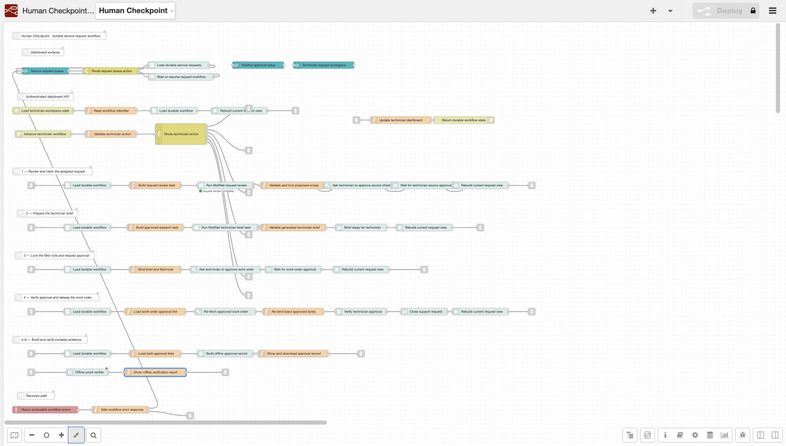

# Human Checkpoint

**Hardware-bound approvals for AI service workflows**

> The agent can ask. Only a human can answer.

Human Checkpoint is a working field-service demonstration. A technician opens
an assigned support request; claims it with a YubiKey; then watches MoltNet
agents review approved past service records and prepare a brief. Node-RED keeps
the work moving across restarts. The workflow stops for the technician twice:

1. When the technician claims the assigned request, before the agent may use
   the public equipment sources shown with that assignment.
2. Before the completed work order, including the technician's field note, is
   released and the support request is closed.

Both decisions require the same enrolled YubiKey 5.8. Each touch signs the
exact decision shown to the technician and produces a different request-scoped
ARKG public key. The final approval record verifies offline and fails after a
one-character change.

## What the technician sees

- A signed-in queue with two open jobs: pump vibration (`SR-2048`) and
  conveyor belt tracking (`SR-2075`), plus pending-review and closed history.
- Reported conveyor photos that the technician can inspect as request evidence.
  The agent does not analyze their pixels or turn them into findings.
- The active request and asset before any agent preparation starts.
- Real MoltNet task IDs, attempt numbers, and current agent-task status.
- A plain-language assignment summary and the exact agent action unlocked by
  claiming it.
- A generated pre-visit brief that distinguishes prior outcomes from the
  current machine's still-unknown condition.
- A required append-only field note before final approval.
- A downloadable approval record, offline verification, and a safe tamper
  demonstration.

The technician never needs MoltNet Console or the Node-RED editor to complete
the work. A signed-in team member can inspect the read-only Node-RED flow at
`/dashboard/node-red/` when explaining or troubleshooting the orchestration.

## Architecture

```text
Authenticated technician browser
  /dashboard/ui/requests -> assigned support request
             |
             v
Node-RED orchestration + SQLite durable store
  stable workflow id, step checkpoints, append-only events
  MoltNet task links, signing-request links, recovery after restart
             |
             +--> technician claims the assigned request
             |       |  loopback signer -> same YubiKey
             |       v
             +--> MoltNet task: review request + approved history
             |       |
             |       v
             +--> MoltNet task: prepare technician brief
             |       |
             |       +--> runtime tool re-fetches hardware approval
             |            and calls Exa with signed scope only
             |
             +--> technician adds field note and approves release
                     |  loopback signer -> same YubiKey
                     v
                  request closes + offline approval record
```

Node-RED is the process orchestrator. SQLite at
`.moltnet/human-checkpoint-demo/human-checkpoint.sqlite` stores support
requests, workflow instances, idempotent step results, task attempts, approval
links, reported-photo BLOBs, and an append-only event journal. Photo bytes are
served only through the authenticated `/dashboard/api/attachments/:id` route
with `Cache-Control: no-store`. They are kept out of the MoltNet task context.
SQLite provides workflow durability to this standalone demo.

The application UI is also part of the Node-RED flow. Three FlowFuse Dashboard
pages (`ui-page` + `ui-template`) emit messages directly into the request,
agent-task, approval, release, and proof branches visible on the canvas. There
is no separate static frontend and no parallel HTTP journey API. HTTP remains
only where the browser needs a security boundary: OIDC, safe configuration,
and the allowlisted MoltNet signing proxy.

[](docs/demo-assets/screenshots/node-red-flow-overview.jpg)

The numbered lanes make the security boundary visible: claim the assigned
request, prepare the technician brief, lock the field note, verify the signed
release, then build and test the portable evidence record. A second
[editor screenshot](docs/demo-assets/screenshots/node-red-flow-ui-and-nodes.jpg)
shows the Human Checkpoint nodes and FlowFuse Dashboard layout beside that same
flow.

MoltNet remains authoritative for task attempts and signing requests. On a
refresh or restart, the dashboard reconstructs its view from SQLite, re-fetches
each linked MoltNet approval, and resumes an existing task ID instead of
silently creating a duplicate.

### Local packages

- `@human-checkpoint/store` — SQLite schema, realistic request history,
  idempotent steps, linked tasks/approvals, and recovery snapshots.
- `@human-checkpoint/core` — canonical decision envelopes, authoritative
  hardware-approval gates, proof export, and offline ESP256 verification.
- `@human-checkpoint/node-red` — direct Node-RED nodes for task creation and
  recovery, signing requests, final release, proof handling, auth routes, and
  the same-origin signing proxy.
- `@human-checkpoint/dashboard` — authenticated request queue, technician UI,
  Node-RED flow, custom MoltNet agent runtime, and profile seeding scripts.

All packages are private workspace packages. The core and store packages are
used directly by the Node-RED package; nothing is published during the demo.

## Security boundary

- Every application page and API, including `http://localhost:1880/`, is behind
  the Human Checkpoint OIDC/team-membership middleware. The Node-RED editor is
  available to signed-in team members as a read-only orchestration view;
  deployment and module installation are disabled. Missing auth configuration
  fails closed with HTTP 503.
- Human OAuth tokens stay AES-GCM sealed in an HttpOnly, SameSite cookie.
  Browser JavaScript receives no bearer or refresh token.
- The signing proxy has an exact method/path allowlist, injects team and bearer
  headers server-side, requires same-origin JSON mutations, caps bodies at 64
  KiB, and returns `Cache-Control: no-store`.
- Browser calls to the local signer use `credentials: omit`; MoltNet cookies and
  headers never reach the HID companion.
- The model-visible public-source tool accepts only a MoltNet signing-request
  ID. It re-fetches the request and derives queries, domains, and result count
  only from its canonical hardware-signed message.
- Before Exa, the runtime validates completed state, exact request ID, team,
  hardware method, purpose, MoltNet proof verdict, canonical encoding,
  checkpoint identity, and policy expiry. Returned URLs must also be HTTPS and
  within the approved domains.
- Final release re-fetches the completed request and re-validates the exact
  brief, field note, role, shift, team, purpose, method, and signature.
- Offline verification checks both ESP256 signatures, request-scoped public
  keys, canonical messages, digests, metadata consistency, and aggregate proof
  hash.

The evidence may retain claimant and credential identifiers. This is
request-scoped key separation and exact-byte accountability—not anonymous or
fully unlinkable signing.

## Requirements

- Node.js 22.19 or newer (Node 24 recommended) and pnpm 10.29.3.
- Docker with AMD64 emulation enabled. The pinned MoltNet application images
  are AMD64; Ory, Postgres, Redis, and the object store run natively where
  available.
- Ollama Cloud and Exa API credentials for the two real agent tasks.
- `@themoltnet/signer` 0.2.0 and one compatible YubiKey 5.8 advertising the
  previewSign extension.

Pinned application dependencies include Node-RED 5.0.1,
`@themoltnet/sdk` 0.128.0, `@themoltnet/agent-daemon` 0.36.0,
`@themoltnet/pi-runtime` 0.6.0, TypeScript 5.9.2, and Vitest 3.2.4.

## Local setup

The local setup is self-contained in this repository. It starts pinned
MoltNet, Ory, Postgres, Redis, and object-store services; creates one agent, one
field technician, and one credential manager; creates their team and private
diary; registers separate agent and dashboard OAuth clients; creates the
enforce-mode runtime profile; and seeds the support-request queue.

1. Install dependencies and provide the two external-service keys:

   ```bash
   pnpm install --frozen-lockfile
   export OLLAMA_API_KEY='your-local-key'
   export EXA_API_KEY='your-local-key'
   ```

2. Provision the complete local environment:

   ```bash
   pnpm run setup:local
   ```

   Generated secrets stay in ignored `.env.local` and
   `.moltnet/human-checkpoint-field-agent/`. The technician and credential
   manager usernames and passwords are stored with mode `0600` in
   `dashboard.json` there.

3. Start the dashboard, real task worker, and signer companion together:

   ```bash
   pnpm run start:local
   ```

4. Open `http://localhost:1880/`. Sign in as the field technician and enroll
   the YubiKey from “YubiKey setup”. Sign out and sign in once as the seeded
   credential manager to activate it. Return to the field technician account
   before opening a request. MoltNet deliberately prevents the credential owner
   from self-approving this activation.

`pnpm run infra:down` stops the local containers without removing their
volumes. `pnpm run setup:local` is idempotent and reuses the generated
identities and runtime profile.

For a non-hardware preflight, `pnpm run rehearse:before-touch` checks the live
Dashboard, signer companion, generated FlowFuse pages, MoltNet task branches,
and absence of the retired journey API. It does not sign in, start a workflow,
create a signing request, or produce evidence.

Before each rehearsal or recording take, stop `pnpm run start:local` and restore
the two seeded jobs to their initial queue state:

```bash
pnpm run demo:reset
```

The command creates a timestamped SQLite backup under
`.moltnet/human-checkpoint-demo/backups/`, removes only the local workflow
trees for `SR-2048` and `SR-2075`, and returns both requests to Open. It
preserves MoltNet identities, team membership, YubiKey enrollment and
activation, runtime profiles, request history, and reported photos. It refuses
any other database path. To reset one job, use
`pnpm run demo:reset -- SR-2048` or `pnpm run demo:reset -- SR-2075`.

The reset removes local links to previous MoltNet tasks and signing requests; it
does not delete authoritative MoltNet records. Restart with
`pnpm run start:local` and use the newly created workflow for the next take.
Do not use ad-hoc `sqlite3` updates.

## Demo procedure

1. Show the authenticated queue: open pump request `SR-2048`, open conveyor
   request `SR-2075`, and pending-review and closed history. The conveyor card
   includes reported photos; open it briefly to show all three if time allows.
2. Open `SR-2048`. Review the assignment, planned equipment lookup, allowed
   sites, and expiry. No history review or brief preparation has started yet.
3. Choose “Claim request with YubiKey” and touch the enrolled key.
4. Only after MoltNet records the claim do the request-review and brief tasks
   start. Their IDs, attempts, and live states appear under MoltNet agent
   activity. The runtime re-fetches the signed claim before the scoped Exa call.
5. Add the required field note, review the final work order, and touch the same
   YubiKey to approve release.
6. Release the order. `SR-2048` moves to the closed queue and the durable
   workflow remains inspectable.
7. Download and verify the approval record, then run the one-character tamper
   demonstration and show verification fail.

## Verification

```bash
pnpm run check
pnpm run build
pnpm run verify-proof -- .moltnet/human-checkpoint-demo/human-checkpoint-proof.json
```

Automated coverage includes canonical rejection, proxy allowlisting and token
non-disclosure, auth fail-closed behavior, customer-scoped history, durable
restart/retry semantics, denial before approval, wrong request/team/scope/
method/purpose failures, final exact-message binding, real ESP256 verification,
different derived keys, and one-character tampering.

Real hardware remains an operator acceptance gate. Never replace a failed
YubiKey ceremony with mocked evidence in a submitted demo.

## Honest limitations

- previewSign is a Yubico firmware-preview extension, not generic WebAuthn or
  PIV signing. Firmware 5.8 alone does not prove that a key supports it.
- The local seed includes a second human credential manager because MoltNet
  enforces separation between credential ownership and activation. The two
  work decisions still belong to the field technician and use the same
  physical YubiKey.
- SQLite is appropriate for this single-server demonstration. Multi-instance
  production orchestration would need coordinated storage and leasing.
- The technical receipt is grouped as a team-manager review surface, but this
  demo does not yet receive a manager role claim in the dashboard session, so
  that disclosure is not a role-based authorization boundary.
- MoltNet, the model provider, Exa, and the signer ceremony require their
  respective services. Only final proof verification is offline.
- A valid signature proves the exact approval ceremony; it does not certify the
  maintenance decision or make AI-generated guidance correct.
- All service requests and equipment details are synthetic demo content.

## YubiKey 5.8 learnings

- Capability detection matters more than a firmware-version string: the signer
  must confirm previewSign and refuse ambiguous multi-device selection.
- ARKG lets MoltNet fix the decision and prepare verification material before
  the private hardware operation occurs.
- “Sign this JSON” is not a sufficient protocol. Canonical bytes, nonce,
  signing envelope, digest, prehash behavior, method ID, purpose, and expiry all
  need explicit binding.
- Five-minute decisions make cancellation, expiry, and fresh-request recovery
  part of the security UX, not edge-case polish.

## Demo and source links

- Submission form:
  <https://docs.google.com/forms/d/e/1FAIpQLSfaczYBBIYY9p3nJDQCmFmpZ0s8cHuhCbV8QP8I-mw5aOYI6A/viewform>
- Live project site: <https://human-checkpoint-getlarge.fly.dev/>
- Demo video:
  <https://human-checkpoint-getlarge.fly.dev/demo-assets/walkthrough.mp4>
- Permanent source: <https://github.com/getlarge/human-checkpoint/tree/v0.1.0>
- Tagged source archive:
  <https://github.com/getlarge/human-checkpoint/archive/refs/tags/v0.1.0.zip>

## License

AGPL-3.0-only. See [LICENSE](LICENSE).
